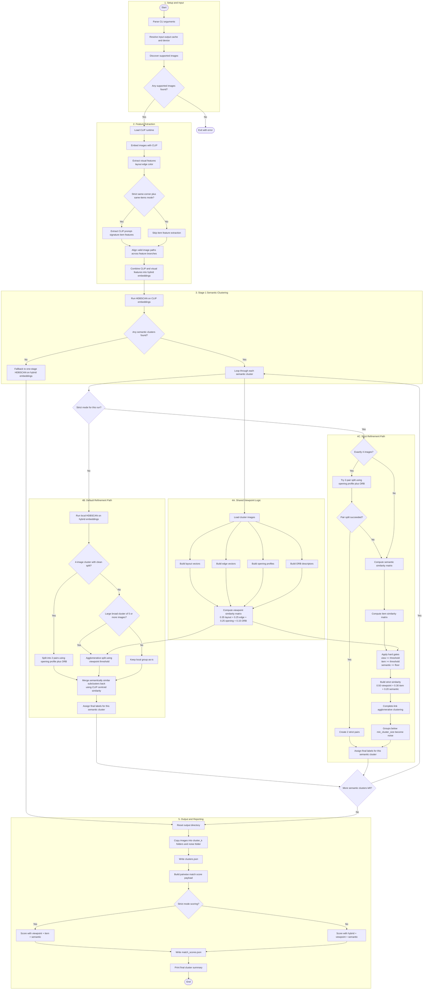

# Pipeline Flow Chart

## Flow Summary

This project runs as a full end-to-end image clustering pipeline:

- input discovery and runtime setup
- CLIP embedding generation
- visual and optional item-feature extraction
- two-stage clustering with default and strict branches
- match-score generation
- output folder and JSON report writing

## Complete Mermaid Flow Diagram



## Step-by-Step Explanation

### 1. Read inputs

The script reads the input directory and keeps only `.jpg`, `.jpeg`, and `.png` files.

### 2. Build semantic embeddings

Each valid image is encoded with CLIP into a normalized embedding. These embeddings are the broad semantic representation of the image.

### 3. Build visual features

Each image also gets hand-crafted visual features:

- coarse grayscale layout
- edge structure
- color histogram

These are used later to separate images that are semantically similar but visually taken from different corners.

### 4. Optional strict item features

If strict mode is enabled, the script also computes a CLIP prompt-signature distribution over a fixed prompt list. This acts as a soft description of visible room/items.

### 5. Align feature rows

If any image failed to load in one feature branch, the script intersects the valid path sets so that every remaining row refers to the same image across all matrices.

### 6. Build hybrid embeddings

The pipeline fuses CLIP embeddings and visual features into one normalized hybrid vector.

Default weighting:

```text
semantic 0.45
layout   0.35
edge     0.15
color    0.05
```

### 7. First-stage clustering

HDBSCAN runs on CLIP embeddings only. This gives broad scene-level groups.

If no stable semantic clusters are found, the pipeline falls back to one-stage HDBSCAN on hybrid embeddings.

### 8. Second-stage refinement

Each semantic cluster is refined using one of two paths.

#### Default path

- cluster hybrid embeddings inside the semantic cluster
- if a cluster is large and broad, split it again using a viewpoint similarity matrix
- if a 4-image cluster looks like two clean pairs, split it into two pairs
- if the split was too aggressive, merge subclusters back by CLIP centroid similarity

#### Strict path

- optionally split 4-image clusters into two pairs first
- otherwise build a strict pairwise similarity matrix
- only allow links when viewpoint, item, and semantic thresholds all pass
- cluster with complete-link agglomerative clustering
- small groups become noise

### 9. Viewpoint similarity details

The viewpoint similarity matrix is built from:

```text
0.35 * layout similarity
+ 0.25 * edge similarity
+ 0.25 * opening profile similarity
+ 0.15 * ORB similarity
```

This is the main score used to judge whether two images are from the same corner or close viewpoints.

### 10. Match score reporting

The pipeline writes `match_scores.json` for inspection.

In strict mode, the reported match score is:

```text
0.50 * viewpoint
+ 0.30 * item
+ 0.20 * semantic
```

In default mode, the reported match score is:

```text
0.55 * hybrid
+ 0.30 * viewpoint
+ 0.15 * semantic
```

### 11. Output writing

The output directory is recreated, then:

- each cluster is copied into its own folder
- noise images are copied into `noise/`
- `clusters.json` and `match_scores.json` are written

## How To Read The Output

- `clusters.json`
  Final cluster membership only.
- `match_scores.json`
  Diagnostic view showing why images were or were not considered strong matches.

## Practical Interpretation

- high semantic score but low viewpoint score means same scene family, different corner
- high viewpoint and high item score usually means a near-duplicate or same-corner match
- noise often means the image is a unique viewpoint, a detail shot, or a threshold miss
